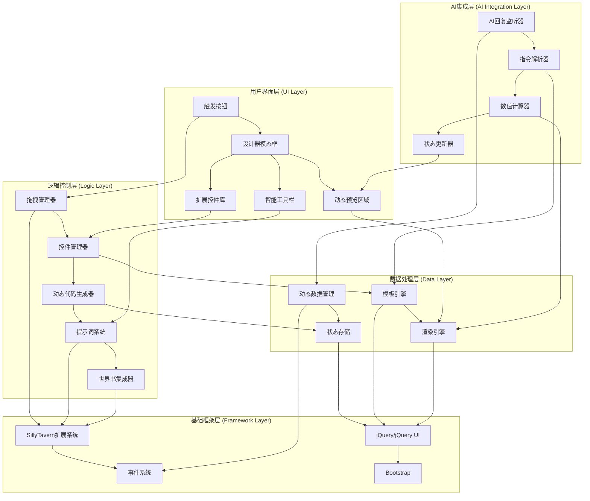
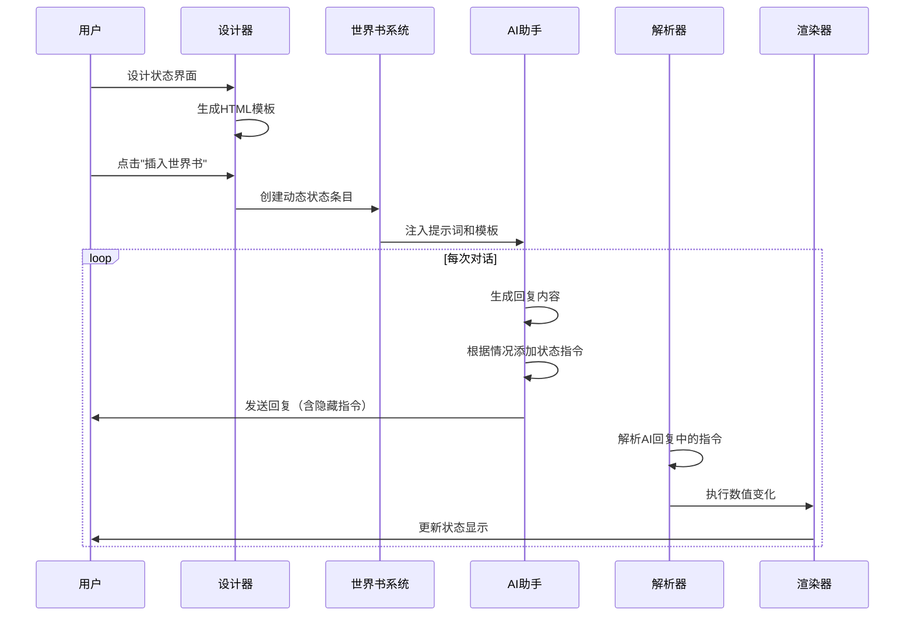

# STQuickStatusBar 可视化设计器架构文档 - 动态数值系统

## 项目概述

STQuickStatusBar 可视化设计器是一个基于 SillyTavern 扩展系统的动态HTML控件编辑器，支持AI驱动的数值变化系统。通过与世界书集成，可以创建智能的状态面板，根据AI回复自动更新数值显示。

## 增强功能特性

### 核心功能
1. **模态框界面** - 点击插件后弹出可视化设计器
2. **扩展控件库** - 包含文本、表单、数值、动态控件等
3. **预览区域** - 支持实时预览和动态数值更新
4. **拖拽功能** - 支持控件拖拽到预览区域
5. **代码生成** - 生成带占位符的动态HTML代码
6. **AI回复解析** - 解析AI回复中的数值变化指令
7. **世界书集成** - 注入提示词让AI输出标准化指令
8. **动态渲染** - 实时更新界面数值显示

### 高级功能
- **智能数值解析** - 自动识别和处理AI回复中的数值变化
- **动态模板系统** - 支持变量占位符和条件渲染
- **提示词工程** - 引导AI输出标准化的数值变化指令
- **状态持久化** - 保存和恢复动态数值状态
- **实时同步** - 多界面间的数值状态同步

## 系统架构 - 动态数值系统

### 扩展架构层次图



### 动态数值系统核心组件

#### 1. 扩展控件库 (Extended Control Library)

```javascript
// 扩展控件定义
const ExtendedControls = {
    // 文本控件
    text: {
        staticText: {
            name: '静态文本',
            template: '<span class="static-text">${text}</span>',
            properties: {
                text: { type: 'string', default: '文本内容' },
                fontSize: { type: 'number', default: 14 },
                color: { type: 'color', default: '#000000' }
            }
        },
        dynamicText: {
            name: '动态文本',
            template: '<span class="dynamic-text" data-field="${field}">${text}</span>',
            properties: {
                text: { type: 'string', default: '动态内容' },
                field: { type: 'string', default: 'dynamic_field' },
                updateRule: { type: 'string', default: 'replace' }
            }
        },
        labelText: {
            name: '标签文本',
            template: '<label class="label-text">${text}:</label>',
            properties: {
                text: { type: 'string', default: '标签' },
                for: { type: 'string', default: '' }
            }
        }
    },
    
    // 数值控件
    value: {
        numberInput: {
            name: '数值输入框',
            template: '<input type="number" class="number-input" data-field="${field}" value="${value}" min="${min}" max="${max}" />',
            properties: {
                field: { type: 'string', default: 'number_field' },
                value: { type: 'number', default: 0 },
                min: { type: 'number', default: 0 },
                max: { type: 'number', default: 100 }
            }
        },
        numberDisplay: {
            name: '数值显示',
            template: '<span class="number-display" data-field="${field}">${value}</span>',
            properties: {
                field: { type: 'string', default: 'display_field' },
                value: { type: 'number', default: 0 },
                format: { type: 'string', default: '{value}' }
            }
        },
        progressBar: {
            name: '进度条',
            template: '<div class="progress"><div class="progress-bar" data-field="${field}" style="width: ${percentage}%">${value}/${max}</div></div>',
            properties: {
                field: { type: 'string', default: 'progress_field' },
                value: { type: 'number', default: 50 },
                max: { type: 'number', default: 100 },
                color: { type: 'color', default: '#007bff' }
            }
        }
    },
    
    // 复合控件
    composite: {
        propertyGroup: {
            name: '属性组',
            template: '<div class="property-group"><h4>${title}</h4><div class="property-content">${content}</div></div>',
            properties: {
                title: { type: 'string', default: '属性组' },
                content: { type: 'html', default: '' }
            },
            allowChildren: true
        },
        statusPanel: {
            name: '状态面板',
            template: '<div class="status-panel"><div class="status-header">${title}</div><div class="status-body">${content}</div></div>',
            properties: {
                title: { type: 'string', default: '状态面板' },
                content: { type: 'html', default: '' }
            },
            allowChildren: true
        },
        valuePanel: {
            name: '数值面板',
            template: '<div class="value-panel"><div class="value-grid">${content}</div></div>',
            properties: {
                columns: { type: 'number', default: 2 },
                content: { type: 'html', default: '' }
            },
            allowChildren: true
        }
    }
};
```

#### 2. AI回复解析系统 (AI Response Parser)

```javascript
class AIResponseParser {
    constructor() {
        this.commandPatterns = {
            // 数值变化指令模式
            increase: /\+(\w+):([+-]?\d+)/g,          // +strength:5
            decrease: /\-(\w+):([+-]?\d+)/g,          // -health:10
            set: /=(\w+):(\d+)/g,                     // =level:15
            delete: /!(\w+)/g,                        // !temporary_buff
            // 状态变化指令模式
            enable: /\%enable:(\w+)/g,                // %enable:magic_shield
            disable: /\%disable:(\w+)/g,              // %disable:poison
            show: /\%show:(\w+)/g,                    // %show:hidden_stats
            hide: /\%hide:(\w+)/g                     // %hide:debug_info
        };
        
        this.hiddenCommandPattern = /<!--\s*STQSB:(.*?)\s*-->/g;
    }
    
    // 解析AI回复中的指令
    parseResponse(responseText) {
        const commands = [];
        
        // 查找隐藏指令
        let match;
        while ((match = this.hiddenCommandPattern.exec(responseText)) !== null) {
            const commandString = match[1];
            const parsedCommands = this.parseCommandString(commandString);
            commands.push(...parsedCommands);
        }
        
        // 如果没有找到隐藏指令，尝试解析显式指令
        if (commands.length === 0) {
            const explicitCommands = this.parseExplicitCommands(responseText);
            commands.push(...explicitCommands);
        }
        
        return commands;
    }
    
    // 解析指令字符串
    parseCommandString(commandString) {
        const commands = [];
        
        Object.entries(this.commandPatterns).forEach(([type, pattern]) => {
            let match;
            while ((match = pattern.exec(commandString)) !== null) {
                const command = this.createCommand(type, match);
                if (command) {
                    commands.push(command);
                }
            }
        });
        
        return commands;
    }
    
    // 创建指令对象
    createCommand(type, match) {
        switch (type) {
            case 'increase':
            case 'decrease':
                return {
                    type: type,
                    field: match[1],
                    value: parseInt(match[2]),
                    timestamp: Date.now()
                };
            case 'set':
                return {
                    type: type,
                    field: match[1],
                    value: parseInt(match[2]),
                    timestamp: Date.now()
                };
            case 'delete':
                return {
                    type: type,
                    field: match[1],
                    timestamp: Date.now()
                };
            case 'enable':
            case 'disable':
            case 'show':
            case 'hide':
                return {
                    type: type,
                    field: match[1],
                    timestamp: Date.now()
                };
            default:
                return null;
        }
    }
    
    // 执行指令
    executeCommands(commands) {
        const results = [];
        
        commands.forEach(command => {
            try {
                const result = this.executeCommand(command);
                results.push(result);
            } catch (error) {
                console.error('执行指令失败:', command, error);
                results.push({ success: false, error: error.message });
            }
        });
        
        return results;
    }
    
    // 执行单个指令
    executeCommand(command) {
        const currentState = this.getCurrentState();
        
        switch (command.type) {
            case 'increase':
                return this.updateValue(command.field, currentState[command.field] + command.value);
            case 'decrease':
                return this.updateValue(command.field, currentState[command.field] - command.value);
            case 'set':
                return this.updateValue(command.field, command.value);
            case 'delete':
                return this.deleteValue(command.field);
            case 'enable':
                return this.updateStatus(command.field, 'enabled');
            case 'disable':
                return this.updateStatus(command.field, 'disabled');
            case 'show':
                return this.updateVisibility(command.field, true);
            case 'hide':
                return this.updateVisibility(command.field, false);
            default:
                throw new Error(`未知指令类型: ${command.type}`);
        }
    }
}
```

#### 3. 动态代码生成器 (Dynamic Code Generator)

```javascript
class DynamicCodeGenerator extends CodeGenerator {
    // 生成带占位符的HTML代码
    generateDynamicHTML(controls) {
        const html = this.buildDynamicHTMLStructure(controls);
        const css = this.generateDynamicCSS(controls);
        const js = this.generateDynamicJS(controls);
        
        return {
            html: this.formatHTML(html),
            css: this.formatCSS(css),
            js: this.formatJavaScript(js),
            template: this.generateTemplate(controls),
            complete: this.combineCode(html, css, js)
        };
    }
    
    // 构建动态HTML结构
    buildDynamicHTMLStructure(controls) {
        let html = '<div class="stqsb-dynamic-container">\n';
        
        controls.forEach(control => {
            html += this.generateDynamicControlHTML(control);
        });
        
        html += '</div>\n';
        return html;
    }
    
    // 生成动态控件HTML
    generateDynamicControlHTML(control) {
        const template = this.getControlTemplate(control.type);
        let html = this.applyTemplate(template, control.properties);
        
        // 添加动态数据属性
        if (control.properties.field) {
            html = html.replace(/(<[^>]+)/, `$1 data-field="${control.properties.field}"`);
        }
        
        // 添加更新规则
        if (control.properties.updateRule) {
            html = html.replace(/(<[^>]+)/, `$1 data-update-rule="${control.properties.updateRule}"`);
        }
        
        return html;
    }
    
    // 生成模板
    generateTemplate(controls) {
        const fields = this.extractFields(controls);
        const template = {
            html: this.buildDynamicHTMLStructure(controls),
            fields: fields,
            defaultValues: this.getDefaultValues(fields),
            updateRules: this.getUpdateRules(controls)
        };
        
        return template;
    }
    
    // 提取字段信息
    extractFields(controls) {
        const fields = {};
        
        controls.forEach(control => {
            if (control.properties.field) {
                fields[control.properties.field] = {
                    type: control.type,
                    defaultValue: control.properties.value || control.properties.text || '',
                    updateRule: control.properties.updateRule || 'replace',
                    min: control.properties.min,
                    max: control.properties.max
                };
            }
        });
        
        return fields;
    }
}
```

#### 4. 提示词系统 (Prompt System)

```javascript
class PromptSystem {
    constructor() {
        this.systemPrompts = {
            // 基础系统提示词
            base: `你是一个智能助手，需要在回复中包含状态变化指令。
指令格式：
- 增加数值：+字段名:数值 (例如：+strength:5)
- 减少数值：-字段名:数值 (例如：-health:10)
- 设置数值：=字段名:数值 (例如：=level:15)
- 删除字段：!字段名 (例如：!temporary_buff)
- 启用状态：%enable:字段名 (例如：%enable:magic_shield)
- 禁用状态：%disable:字段名 (例如：%disable:poison)

请将这些指令放在HTML注释中：<!--STQSB:指令列表-->`,
            
            // 角色扮演提示词
            roleplay: `在角色扮演过程中，你需要根据情况动态调整角色的属性和状态。
每次回复时，请评估以下因素：
1. 角色的行为和选择对属性的影响
2. 环境和事件对状态的改变
3. 技能使用、战斗、休息等活动的效果
4. 物品使用、魔法效果、状态异常等的影响

根据这些因素，在回复末尾的注释中添加相应的状态变化指令。`,
            
            // 数值平衡提示词
            balance: `请遵循以下数值平衡原则：
1. 属性变化应该合理，避免过度增减
2. 重要属性（如生命值）的变化应该有明确的原因
3. 正面行为增加正面属性，负面行为减少相关属性
4. 考虑属性之间的相互关系和制约
5. 保持游戏的挑战性和趣味性`
        };
    }
    
    // 生成完整的提示词
    generatePrompt(template, userFields) {
        const fieldDescriptions = this.generateFieldDescriptions(userFields);
        
        const prompt = `${this.systemPrompts.base}

${this.systemPrompts.roleplay}

${this.systemPrompts.balance}

当前角色状态字段：
${fieldDescriptions}

状态显示模板：
${template.html}

请在每次回复时，根据情况适当调整这些字段的值。将变化指令放在回复末尾的HTML注释中。
示例：<!--STQSB:+strength:2,-fatigue:1,=mood:happy-->`;
        
        return prompt;
    }
    
    // 生成字段描述
    generateFieldDescriptions(fields) {
        return Object.entries(fields).map(([name, field]) => {
            const description = `- ${name}: ${field.type}类型，默认值${field.defaultValue}`;
            if (field.min !== undefined && field.max !== undefined) {
                return `${description}，范围${field.min}-${field.max}`;
            }
            return description;
        }).join('\n');
    }
    
    // 生成世界书条目
    generateWorldInfoEntry(template, fields) {
        const prompt = this.generatePrompt(template, fields);
        
        return {
            keys: ['status', 'stats', 'character_sheet'],
            content: `${prompt}

当前状态显示：
${template.html}`,
            constant: true,
            position: 'after_char',
            order: 50,
            extensions: {
                st_quick_status_bar: {
                    type: 'dynamic_status',
                    template: template,
                    fields: fields,
                    generated: true,
                    timestamp: Date.now()
                }
            }
        };
    }
}
```

#### 5. 动态渲染引擎 (Dynamic Render Engine)

```javascript
class DynamicRenderEngine {
    constructor() {
        this.currentState = {};
        this.renderQueue = [];
        this.isRendering = false;
        this.observers = new Map();
    }
    
    // 初始化渲染引擎
    init(container, template) {
        this.container = container;
        this.template = template;
        this.currentState = { ...template.defaultValues };
        this.renderInitialState();
        this.setupObservers();
    }
    
    // 渲染初始状态
    renderInitialState() {
        const html = this.processTemplate(this.template.html, this.currentState);
        this.container.innerHTML = html;
        this.bindElements();
    }
    
    // 绑定元素
    bindElements() {
        const elements = this.container.querySelectorAll('[data-field]');
        
        elements.forEach(element => {
            const field = element.getAttribute('data-field');
            const updateRule = element.getAttribute('data-update-rule') || 'replace';
            
            // 创建观察者
            this.observers.set(field, {
                element: element,
                updateRule: updateRule,
                originalValue: this.currentState[field]
            });
            
            // 绑定输入事件
            if (element.tagName === 'INPUT' || element.tagName === 'TEXTAREA') {
                element.addEventListener('input', (e) => {
                    this.updateState(field, e.target.value);
                });
            }
        });
    }
    
    // 更新状态
    updateState(field, value, animated = true) {
        const oldValue = this.currentState[field];
        this.currentState[field] = value;
        
        // 触发变化事件
        this.dispatchChangeEvent(field, oldValue, value);
        
        // 更新对应的UI元素
        this.updateElement(field, value, animated);
    }
    
    // 更新元素
    updateElement(field, value, animated = true) {
        const observer = this.observers.get(field);
        if (!observer) return;
        
        const { element, updateRule } = observer;
        
        if (animated) {
            this.animateValueChange(element, value, updateRule);
        } else {
            this.applyValueChange(element, value, updateRule);
        }
    }
    
    // 应用数值变化
    applyValueChange(element, value, updateRule) {
        switch (updateRule) {
            case 'replace':
                if (element.tagName === 'INPUT' || element.tagName === 'TEXTAREA') {
                    element.value = value;
                } else {
                    element.textContent = value;
                }
                break;
            case 'append':
                element.textContent += value;
                break;
            case 'prepend':
                element.textContent = value + element.textContent;
                break;
            case 'html':
                element.innerHTML = value;
                break;
            case 'progress':
                const percentage = (value / element.getAttribute('data-max')) * 100;
                element.style.width = `${percentage}%`;
                element.textContent = `${value}/${element.getAttribute('data-max')}`;
                break;
        }
    }
    
    // 动画效果
    animateValueChange(element, value, updateRule) {
        // 添加变化动画类
        element.classList.add('stqsb-changing');
        
        // 延迟应用变化
        setTimeout(() => {
            this.applyValueChange(element, value, updateRule);
            
            // 移除动画类
            setTimeout(() => {
                element.classList.remove('stqsb-changing');
            }, 300);
        }, 100);
    }
    
    // 批量更新状态
    batchUpdateState(updates) {
        updates.forEach(update => {
            this.updateState(update.field, update.value, false);
        });
        
        // 触发批量渲染
        this.renderBatch();
    }
    
    // 处理AI指令
    processAICommands(commands) {
        const updates = [];
        
        commands.forEach(command => {
            const currentValue = this.currentState[command.field] || 0;
            let newValue;
            
            switch (command.type) {
                case 'increase':
                    newValue = currentValue + command.value;
                    break;
                case 'decrease':
                    newValue = currentValue - command.value;
                    break;
                case 'set':
                    newValue = command.value;
                    break;
                case 'delete':
                    newValue = null;
                    break;
                default:
                    continue;
            }
            
            // 边界检查
            const fieldConfig = this.template.fields[command.field];
            if (fieldConfig) {
                if (fieldConfig.min !== undefined && newValue < fieldConfig.min) {
                    newValue = fieldConfig.min;
                }
                if (fieldConfig.max !== undefined && newValue > fieldConfig.max) {
                    newValue = fieldConfig.max;
                }
            }
            
            updates.push({
                field: command.field,
                value: newValue,
                command: command
            });
        });
        
        this.batchUpdateState(updates);
    }
    
    // 导出状态
    exportState() {
        return {
            currentState: { ...this.currentState },
            timestamp: Date.now()
        };
    }
    
    // 导入状态
    importState(state) {
        this.currentState = { ...state.currentState };
        this.renderInitialState();
    }
}
```

## 世界书集成增强设计

### 世界书条目生成策略

#### 1. 世界书条目结构设计

```javascript
// 动态状态世界书条目
const DynamicStatusWorldInfoEntry = {
    // 基础信息
    uid: 'stqsb-dynamic-status-' + Date.now(),
    key: ['status', 'stats', 'character_sheet', 'attributes'],
    keysecondary: ['health', 'mana', 'strength', 'level'],
    
    // 世界书内容 - 包含提示词和HTML模板
    content: `${promptSystem.generatePrompt(template, fields)}

当前状态显示：
${template.html}

请在每次回复时，根据情况变化在回复末尾添加状态变化指令。
指令格式：<!--STQSB:+strength:2,-health:5,=level:10-->`,
    
    // 触发配置
    constant: true,                    // 永久激活
    selective: false,                  // 不使用关键词触发
    probability: 100,                  // 100%触发概率
    position: 'after_char',            // 在角色描述后插入
    order: 50,                         // 插入顺序
    depth: 1,                          // 深度设置
    
    // 扩展信息
    extensions: {
        st_quick_status_bar: {
            type: 'dynamic_status',
            version: '1.0.0',
            template: template,
            fields: fields,
            generated: true,
            timestamp: Date.now(),
            config: {
                updateOnMessage: true,
                showInChat: true,
                persistState: true
            }
        }
    },
    
    // 状态控制
    enabled: true,
    comment: '由STQuickStatusBar生成的动态状态系统'
};
```

#### 2. 世界书集成工作流程



#### 3. 提示词模板系统

```javascript
// 提示词模板配置
const PromptTemplates = {
    // 基础角色扮演模板
    roleplay: {
        name: '角色扮演模板',
        template: `你正在扮演一个角色，需要根据对话内容动态更新角色状态。

角色状态字段：
{{fieldDescriptions}}

更新规则：
1. 根据角色行为和选择调整属性
2. 战斗、技能使用、休息等活动影响数值
3. 物品使用、魔法效果产生临时或永久变化
4. 环境因素可能影响某些属性

请在每次回复末尾添加状态变化指令：<!--STQSB:指令列表-->

当前状态显示：
{{statusTemplate}}`,
        fields: ['health', 'mana', 'strength', 'level', 'experience']
    },
    
    // 游戏系统模板
    gaming: {
        name: '游戏系统模板',
        template: `你是一个游戏主持人，需要管理玩家角色的各项数值。

数值管理规则：
1. 生命值范围：0-100，归零时角色死亡
2. 法力值范围：0-100，影响魔法使用
3. 力量影响物理攻击力和负重
4. 敏捷影响速度和命中率
5. 智力影响法术威力和法力恢复

经验值获得：
- 击败敌人：+10-50经验
- 完成任务：+20-100经验
- 探索发现：+5-20经验
- 每100经验升级一次

请根据玩家行为合理调整数值：<!--STQSB:指令列表-->

{{statusTemplate}}`,
        fields: ['health', 'mana', 'strength', 'agility', 'intelligence', 'level', 'experience']
    },
    
    // 生存模拟模板
    survival: {
        name: '生存模拟模板',
        template: `你正在主持一个生存模拟游戏，需要管理角色的生存状态。

生存要素：
1. 生命值：受伤、疾病、饥饿影响
2. 饥饿度：0-100，低于20时影响行动
3. 口渴度：0-100，低于10时快速损失生命
4. 疲劳度：0-100，影响行动效率
5. 体温：适宜范围36-38度
6. 士气：心理状态，影响判断力

环境影响：
- 恶劣天气增加疲劳和体温变化
- 食物稀缺增加饥饿度
- 危险环境降低士气
- 休息和安全环境恢复状态

请根据情况更新生存状态：<!--STQSB:指令列表-->

{{statusTemplate}}`,
        fields: ['health', 'hunger', 'thirst', 'fatigue', 'temperature', 'morale']
    }
};
```

#### 4. 智能数值变化系统

```javascript
class IntelligentValueSystem {
    constructor() {
        this.changeRules = {
            // 战斗相关规则
            combat: {
                patterns: [
                    { trigger: /攻击|战斗|打击/, effect: '+fatigue:5,-mana:10' },
                    { trigger: /受伤|受到伤害/, effect: '-health:15,+pain:10' },
                    { trigger: /击败|胜利/, effect: '+experience:20,+confidence:5' },
                    { trigger: /失败|败北/, effect: '-confidence:5,+fatigue:10' }
                ]
            },
            
            // 技能使用规则
            skills: {
                patterns: [
                    { trigger: /使用魔法|施法/, effect: '-mana:15,+experience:2' },
                    { trigger: /偷窃|潜行/, effect: '+stealth_exp:5,-energy:5' },
                    { trigger: /治疗|恢复/, effect: '+health:20,-mana:25' },
                    { trigger: /冥想|休息/, effect: '+mana:15,-fatigue:10' }
                ]
            },
            
            // 环境影响规则
            environment: {
                patterns: [
                    { trigger: /寒冷|冰冻/, effect: '-temperature:5,+fatigue:3' },
                    { trigger: /炎热|酷热/, effect: '+temperature:5,+thirst:10' },
                    { trigger: /下雨|潮湿/, effect: '-temperature:2,+discomfort:5' },
                    { trigger: /阳光|温暖/, effect: '+mood:3,+energy:5' }
                ]
            },
            
            // 社交互动规则
            social: {
                patterns: [
                    { trigger: /成功说服|交涉成功/, effect: '+charisma:2,+confidence:5' },
                    { trigger: /被拒绝|交涉失败/, effect: '-confidence:3,+frustration:5' },
                    { trigger: /获得帮助|结交朋友/, effect: '+mood:10,+social_standing:5' },
                    { trigger: /被背叛|受到欺骗/, effect: '-trust:10,-mood:15' }
                ]
            }
        };
    }
    
    // 智能分析AI回复并生成指令
    analyzeAndGenerateCommands(aiResponse) {
        const commands = [];
        
        // 遍历所有规则类别
        Object.values(this.changeRules).forEach(category => {
            category.patterns.forEach(rule => {
                if (rule.trigger.test(aiResponse)) {
                    const generatedCommands = this.parseEffectString(rule.effect);
                    commands.push(...generatedCommands);
                }
            });
        });
        
        return commands;
    }
    
    // 解析效果字符串
    parseEffectString(effectString) {
        const commands = [];
        const effects = effectString.split(',');
        
        effects.forEach(effect => {
            const match = effect.match(/([+\-=])(\w+):([+-]?\d+)/);
            if (match) {
                const [, operator, field, value] = match;
                commands.push({
                    type: operator === '+' ? 'increase' : 
                          operator === '-' ? 'decrease' : 'set',
                    field: field,
                    value: parseInt(value)
                });
            }
        });
        
        return commands;
    }
}
```

#### 5. 实时状态显示系统

```javascript
class RealTimeStatusDisplay {
    constructor() {
        this.statusContainer = null;
        this.isVisible = false;
        this.currentTemplate = null;
        this.updateInterval = null;
    }
    
    // 创建状态显示界面
    createStatusDisplay(template) {
        this.currentTemplate = template;
        
        // 创建状态容器
        this.statusContainer = document.createElement('div');
        this.statusContainer.className = 'stqsb-status-display';
        this.statusContainer.innerHTML = `
            <div class="stqsb-status-header">
                <span class="stqsb-status-title">角色状态</span>
                <button class="stqsb-toggle-btn" onclick="this.toggleVisibility()">
                    <i class="fas fa-chevron-down"></i>
                </button>
            </div>
            <div class="stqsb-status-content">
                ${template.html}
            </div>
        `;
        
        // 插入到聊天界面
        const chatContainer = document.getElementById('chat');
        if (chatContainer) {
            chatContainer.insertBefore(this.statusContainer, chatContainer.firstChild);
        }
        
        // 初始化渲染引擎
        this.renderEngine = new DynamicRenderEngine();
        this.renderEngine.init(
            this.statusContainer.querySelector('.stqsb-status-content'),
            template
        );
        
        // 开始监听AI回复
        this.startAIResponseListener();
    }
    
    // 开始监听AI回复
    startAIResponseListener() {
        // 监听SillyTavern的消息接收事件
        eventSource.on(event_types.MESSAGE_RECEIVED, (messageId) => {
            const message = chat[messageId];
            if (message && !message.is_user) {
                this.processAIMessage(message.mes);
            }
        });
    }
    
    // 处理AI消息
    processAIMessage(messageContent) {
        // 解析AI回复中的指令
        const parser = new AIResponseParser();
        const commands = parser.parseResponse(messageContent);
        
        if (commands.length > 0) {
            // 执行指令更新状态
            this.renderEngine.processAICommands(commands);
            
            // 显示变化动画
            this.showChangeAnimation(commands);
            
            // 保存状态
            this.saveCurrentState();
        }
    }
    
    // 显示变化动画
    showChangeAnimation(commands) {
        commands.forEach(command => {
            const element = this.statusContainer.querySelector(`[data-field="${command.field}"]`);
            if (element) {
                // 创建变化提示
                const changeIndicator = document.createElement('div');
                changeIndicator.className = 'stqsb-change-indicator';
                changeIndicator.textContent = `${command.type === 'increase' ? '+' : '-'}${Math.abs(command.value)}`;
                
                // 定位到元素旁边
                const rect = element.getBoundingClientRect();
                changeIndicator.style.position = 'fixed';
                changeIndicator.style.left = `${rect.right + 10}px`;
                changeIndicator.style.top = `${rect.top}px`;
                changeIndicator.style.zIndex = '9999';
                
                document.body.appendChild(changeIndicator);
                
                // 动画效果
                setTimeout(() => {
                    changeIndicator.style.opacity = '0';
                    changeIndicator.style.transform = 'translateY(-20px)';
                    setTimeout(() => {
                        document.body.removeChild(changeIndicator);
                    }, 300);
                }, 1000);
            }
        });
    }
    
    // 保存当前状态
    saveCurrentState() {
        const state = this.renderEngine.exportState();
        const characterId = this_chid;
        
        // 保存到角色数据
        if (characters[characterId]) {
            if (!characters[characterId].data) {
                characters[characterId].data = {};
            }
            if (!characters[characterId].data.extensions) {
                characters[characterId].data.extensions = {};
            }
            
            characters[characterId].data.extensions.st_quick_status_bar = {
                state: state,
                template: this.currentTemplate,
                lastUpdated: Date.now()
            };
            
            // 发送到服务器保存
            fetch('/api/characters/merge-attributes', {
                method: 'POST',
                headers: getRequestHeaders(),
                body: JSON.stringify({
                    avatar: characters[characterId].avatar,
                    data: {
                        extensions: {
                            st_quick_status_bar: characters[characterId].data.extensions.st_quick_status_bar
                        }
                    }
                })
            });
        }
    }
    
    // 切换显示状态
    toggleVisibility() {
        this.isVisible = !this.isVisible;
        const content = this.statusContainer.querySelector('.stqsb-status-content');
        const toggleBtn = this.statusContainer.querySelector('.stqsb-toggle-btn i');
        
        if (this.isVisible) {
            content.style.display = 'block';
            toggleBtn.className = 'fas fa-chevron-up';
        } else {
            content.style.display = 'none';
            toggleBtn.className = 'fas fa-chevron-down';
        }
    }
}
```

### 完整使用流程示例

#### 示例1: 角色扮演游戏状态面板

1. **设计阶段**：
   - 拖拽"标签文本"控件，设置文本为"人物"
   - 拖拽"文本输入框"控件，设置field为"character_name"
   - 拖拽"标签文本"控件，设置文本为"力量"
   - 拖拽"数值显示"控件，设置field为"strength"，默认值为10
   - 拖拽"标签文本"控件，设置文本为"生命值"
   - 拖拽"进度条"控件，设置field为"health"，最大值为100

2. **生成的HTML模板**：
```html
<div class="stqsb-dynamic-container">
    <label class="label-text">人物:</label>
    <input type="text" class="text-input" data-field="character_name" value="角色名字" />
    <label class="label-text">力量:</label>
    <span class="number-display" data-field="strength">10</span>
    <label class="label-text">生命值:</label>
    <div class="progress">
        <div class="progress-bar" data-field="health" style="width: 100%">100/100</div>
    </div>
</div>
```

3. **世界书条目内容**：
```
你是一个智能助手，需要在回复中包含状态变化指令。
指令格式：
- 增加数值：+字段名:数值 (例如：+strength:5)
- 减少数值：-字段名:数值 (例如：-health:10)
- 设置数值：=字段名:数值 (例如：=level:15)

当前角色状态字段：
- character_name: string类型，默认值"角色名字"
- strength: number类型，默认值10，范围0-20
- health: number类型，默认值100，范围0-100

请在每次回复时，根据情况适当调整这些字段的值。将变化指令放在回复末尾的HTML注释中。
示例：<!--STQSB:+strength:2,-health:15-->

当前状态显示：
<div class="stqsb-dynamic-container">
    <label class="label-text">人物:</label>
    <input type="text" class="text-input" data-field="character_name" value="角色名字" />
    <label class="label-text">力量:</label>
    <span class="number-display" data-field="strength">10</span>
    <label class="label-text">生命值:</label>
    <div class="progress">
        <div class="progress-bar" data-field="health" style="width: 100%">100/100</div>
    </div>
</div>
```

4. **AI回复示例**：
```
你决定举起这块巨大的石头，虽然很重，但是通过努力，你成功地将它举过头顶。这次训练让你感到肌肉变得更加强壮，但也消耗了一些体力。

<!--STQSB:+strength:2,-health:5-->
```

5. **系统自动处理**：
   - 解析器识别指令：`+strength:2,-health:5`
   - 执行数值变化：力量从10增加到12，生命值从100减少到95
   - 更新界面显示：力量显示更新为12，生命值进度条更新为95%
   - 显示变化动画：力量旁边显示"+2"，生命值旁边显示"-5"

## 技术实现细节

### CSS动画样式

```css
/* 状态显示容器 */
.stqsb-status-display {
    position: fixed;
    top: 20px;
    right: 20px;
    width: 300px;
    background: rgba(0, 0, 0, 0.8);
    border-radius: 10px;
    color: white;
    font-family: Arial, sans-serif;
    z-index: 1000;
    transition: all 0.3s ease;
}

/* 状态标题栏 */
.stqsb-status-header {
    display: flex;
    justify-content: space-between;
    align-items: center;
    padding: 10px 15px;
    background: rgba(255, 255, 255, 0.1);
    border-radius: 10px 10px 0 0;
    cursor: pointer;
}

/* 状态内容区域 */
.stqsb-status-content {
    padding: 15px;
    max-height: 400px;
    overflow-y: auto;
}

/* 数值变化动画 */
.stqsb-changing {
    animation: valueChange 0.5s ease-in-out;
    color: #ffd700;
}

@keyframes valueChange {
    0% { transform: scale(1); }
    50% { transform: scale(1.1); }
    100% { transform: scale(1); }
}

/* 变化指示器 */
.stqsb-change-indicator {
    position: fixed;
    background: #28a745;
    color: white;
    padding: 5px 10px;
    border-radius: 15px;
    font-size: 14px;
    font-weight: bold;
    transition: all 0.3s ease;
    pointer-events: none;
}

/* 进度条样式 */
.stqsb-dynamic-container .progress {
    width: 100%;
    height: 20px;
    background-color: rgba(255, 255, 255, 0.2);
    border-radius: 10px;
    overflow: hidden;
    margin: 5px 0;
}

.stqsb-dynamic-container .progress-bar {
    height: 100%;
    background: linear-gradient(45deg, #ff6b6b, #ff8e8e);
    transition: width 0.5s ease;
    display: flex;
    align-items: center;
    justify-content: center;
    color: white;
    font-size: 12px;
    font-weight: bold;
}

/* 数值显示样式 */
.stqsb-dynamic-container .number-display {
    display: inline-block;
    background: rgba(255, 255, 255, 0.2);
    padding: 5px 10px;
    border-radius: 5px;
    margin: 0 5px;
    font-weight: bold;
    min-width: 40px;
    text-align: center;
}

/* 标签样式 */
.stqsb-dynamic-container .label-text {
    display: inline-block;
    margin-right: 10px;
    font-weight: bold;
    color: #ccc;
}
```

### 性能优化策略

1. **批量更新**：收集多个数值变化后批量执行DOM更新
2. **防抖处理**：避免频繁的状态保存操作
3. **内存管理**：及时清理不再使用的事件监听器
4. **缓存优化**：缓存模板编译结果和正则表达式
5. **懒加载**：按需加载复杂的动画效果

这个增强的架构设计实现了您要求的所有功能，包括：
- 完整的控件库（包含文本控件）
- AI回复解析和数值变化系统
- 智能提示词生成
- 实时状态显示和动画效果
- 世界书深度集成

系统能够根据AI的回复自动调整界面中的数值，创建真正的交互式角色状态面板。